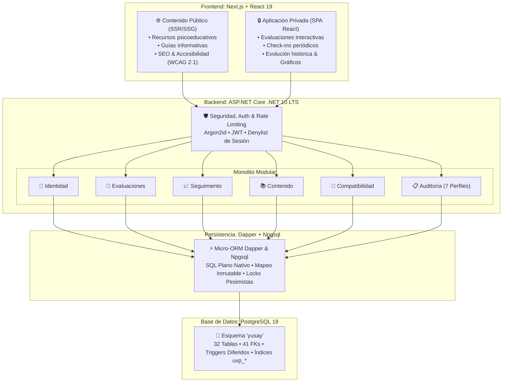

<div align="center">

# 🌿 Yusay

**Comprende tu bienestar a través del tiempo.**

*Seguimiento personal estructurado de la salud emocional mediante autoevaluaciones validadas, registros periódicos y privacidad por diseño.*

---

[](docs/06-decisions/ADR-001-database-engine.md)
[](docs/06-decisions/ADR-002-technology-stack.md)
[](docs/06-decisions/ADR-002-technology-stack.md)
[](docs/06-decisions/ADR-002-technology-stack.md)
[](docs/06-decisions/ADR-002-technology-stack.md)
[](docs/05-data/physical-model-v1/06-verificacion-y-dictamen.md)

</div>

---

## 📖 Acerca de Yusay

**Yusay** es una plataforma orientada a explorar el bienestar emocional de forma no clínica, continua y fundamentada. Permite a los usuarios comprender sus dinámicas emocionales a lo largo del tiempo combinando tres pilares esenciales:

1. **Autoevaluaciones estructuradas:** Instrumentos psicométricos validados con escalas estandarizadas, cálculo de puntuación determinista y reproductibilidad histórica exacta.
2. **Seguimiento periódico (Check-Ins):** Registro multidimensional rápido y contextualizado con ventanas estrictas de consistencia temporal.
3. **Privacidad por diseño (Privacy by Design):** Soberanía total de datos personales, disociación irreversible de eventos de auditoría y derecho al olvido garantizado (`DP-TRANS-001`).

> [!NOTE]
> Yusay surge como un replanteamiento arquitectónico e integral desde cero, superando antecedentes previos para fundar un modelo relacional y un stack tecnológico normativo, robusto y verificable.

---

## 🏛️ Arquitectura del Sistema

El sistema implementa una arquitectura desacoplada pero cohesiva, diseñada para maximizar el rendimiento, la accesibilidad y la integridad de los datos:



---

## 🛠️ Stack Tecnológico Consolidado

La plataforma se apoya en decisiones formales registradas mediante Architecture Decision Records:

| Capa / Rol | Tecnología Seleccionada | Justificación Arquitectónica |
| :--- | :--- | :--- |
| **Frontend** | **Next.js (React 19, TypeScript)** | Renderizado híbrido: **SSR/SSG** para contenido público indexable y accesible (SEO + WCAG 2.1 AA), combinado con **SPA reactiva** para paneles privados. |
| **Backend** | **ASP.NET Core (.NET 10 LTS)** | Monolito modular de alto rendimiento de I/O. Centraliza el 100% de las reglas de negocio, cálculo de scores y seguridad. |
| **Acceso a Datos** | **Dapper + Npgsql** | Micro-ORM transparente y driver de alto rendimiento. Respeta el DDL normativo de PostgreSQL 18 sin abstracciones invasivas. |
| **Base de Datos** | **PostgreSQL 18** | Motor relacional principal ([ADR-001](docs/06-decisions/ADR-001-database-engine.md)). Soporte nativo para `uuid`, `jsonb`, índices únicos parciales y restricciones diferibles. |
| **Migraciones** | **Flyway CLI** | Migraciones SQL versionadas (`V001__*.sql`), transaccionales y desacopladas de frameworks de aplicación. |
| **Testing** | **xUnit + Testcontainers** | Pruebas de integración relacional contra instancias reales en contenedor de PostgreSQL 18. |
| **Entorno Local** | **Docker Compose** | Orquestación reproducible y aislada de base de datos, migraciones y dependencias auxiliares. |

---

## 📊 Estado Actual del Proyecto

El proyecto ha completado todas las etapas de diseño conceptual, lógico y físico antes de iniciar el código de producción:

```text
Discovery & Problema       ████████████████████ 100% [Baseline cerrado]
Definición de Producto     ████████████████████ 100% [Baseline cerrado]
Reglas de Negocio          ████████████████████ 100% [Baseline cerrado]
Modelo Conceptual v0.1     ████████████████████ 100% [v0.1 CLOSED]
Modelo Lógico v1.0         ████████████████████ 100% [APPROVED / FROZEN]
Modelo Físico v1.0         ████████████████████ 100% [Aprobado con condiciones]
Decisiones Técnicas (ADR)  ████████████████████ 100% [ADR-001 & ADR-002 ACCEPTED]
Implementación / DDL       ░░░░░░░░░░░░░░░░░░░░   0% [Listo para iniciar]
```

---

## 🧭 Mapa Documental

Toda la documentación técnica se encuentra versionada y organizada en el directorio [`docs/`](docs/):

* [**01 — Discovery**](docs/01-discovery/): [Problema](docs/01-discovery/problem-statement.md), [análisis de hipótesis](docs/01-discovery/problem-analysis.md), [usuarios objetivo](docs/01-discovery/target-users.md) y [propuesta de valor](docs/01-discovery/value-proposition.md).
* [**02 — Product**](docs/02-product/): [Definición del producto](docs/02-product/product-definition.md), [alcance y límites](docs/02-product/scope.md), [requisitos funcionales](docs/02-product/functional-requirements.md) y [reglas de negocio](docs/02-product/business-rules.md).
* [**03 — Domain**](docs/03-domain/): [Lenguaje ubicuo](docs/03-domain/ubiquitous-language.md), [visión del dominio](docs/03-domain/domain-overview.md), [bounded contexts](docs/03-domain/bounded-contexts.md) y [modelo conceptual v0.1](docs/03-domain/conceptual-model.md).
* [**04 — Architecture**](docs/04-architecture/): [Principios técnicos y estado arquitectónico](docs/04-architecture/README.md).
* [**05 — Data Modeling**](docs/05-data/):
  * [**Modelo Lógico v1.0**](docs/05-data/logical-model-v1/): 32 relaciones, 147 atributos, 41 FKs y [dictamen normativo](docs/05-data/logical-model-v1/12-dictamen-modelo-logico-v1.md).
  * [**Modelo Físico v1.0 (PostgreSQL 18)**](docs/05-data/physical-model-v1/): [Mapeo físico](docs/05-data/physical-model-v1/02-decisiones-y-mapeo-fisico.md), [integridad e índices](docs/05-data/physical-model-v1/03-integridad-e-indices.md), [transacciones y concurrencia](docs/05-data/physical-model-v1/04-transacciones-y-concurrencia.md), [privacidad](docs/05-data/physical-model-v1/05-privacidad-eliminacion-y-operacion.md) y [dictamen de cierre](docs/05-data/physical-model-v1/06-verificacion-y-dictamen.md).
* [**06 — Architecture Decision Records**](docs/06-decisions/):
  * [**ADR-001: Database Engine**](docs/06-decisions/ADR-001-database-engine.md) — Selección de PostgreSQL como motor relacional.
  * [**ADR-002: Technology Stack**](docs/06-decisions/ADR-002-technology-stack.md) — Consolidación de Next.js, ASP.NET Core 10 LTS, Dapper, Npgsql y Flyway.

---

## 🎯 Principios Rectores del Proyecto

> **1. Integridad Persistente:** La base de datos es la autoridad última de la integridad estructural relacional. La aplicación complementa pero nunca sustituye las restricciones del motor.
> 
> **2. Responsabilidad de Aplicación:** Las reglas de negocio, autorización y orquestación de casos de uso residen exclusivamente en el backend.
> 
> **3. Reproducibilidad Histórica:** Las evaluaciones históricas se preservan inmutables respecto a la versión exacta bajo la cual fueron respondidas.
> 
> **4. Sin Complejidad Accidental:** No se introducen microservicios, frameworks pesados ni infraestructura adicional sin un requisito justificado.
> 
> **5. Privacidad por Diseño:** Recopilación mínima de datos, anonimización transaccional de auditoría y derecho al olvido efectivo e irreversible.

---

<div align="center">
  <sub>Yusay Platform · 2026 · Diseñado con rigor relacional, seguridad y privacidad.</sub>
</div>
